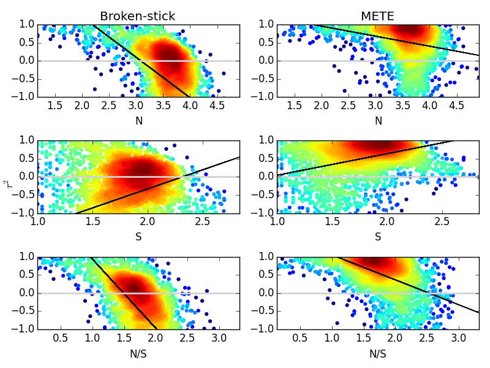
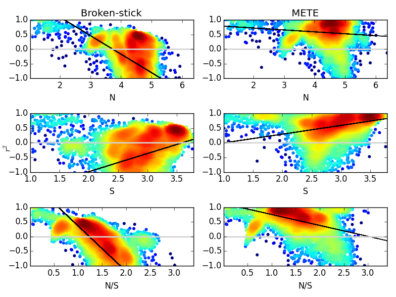
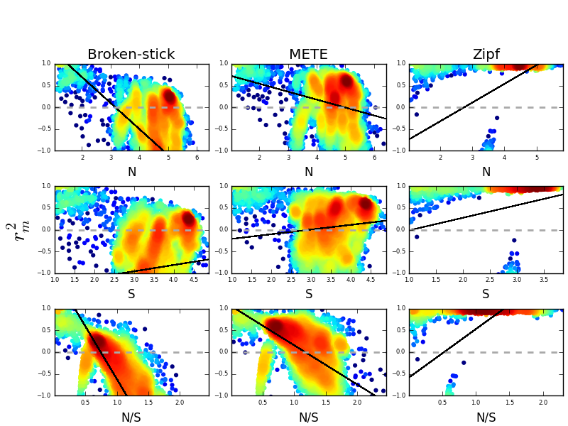
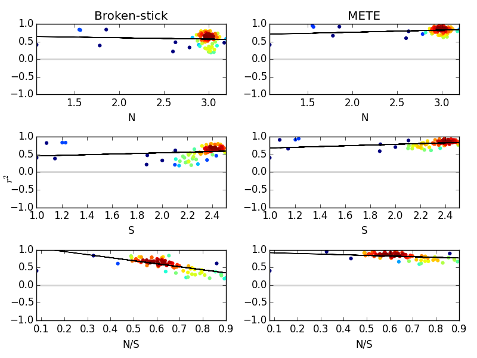

# Introduction

Understanding patterns of abundance, distribution, and diversity is a central goal of ecology (Brown 1995). 
Among the most universal of these patterns is the observation that few species in most ecological communities are relatively abundant, while most are relatively rare. 
Explaining this has been a major focus of community ecology and ecological theory for several decades (e.g., Motomura 1932, Fisher et al. 1943, Preston 1948, MacArthur 1957, Whittaker 1972, Sugihara 1980, Tokeshi 1990, Hubbell 2001, Tilman 2004). 
But, while many models predict uneven species abundance distributions (SAD) as the result of resource partitioning, dispersal limitation and demographic stochasticity, and competition and coexistence, the most successful models have been statistical (e.g., Fisher et al. 1943, Preston 1948).

A new paradigm in predicting the SAD takes a statistical constraint-based approach (Harte et al. 2008, 2009, Harte 2011, Pueyo et al. 2006, White et al. 2012, Locey and White 2013, Xiao et al. 2014). 
Recognizing that the form of the SAD is constrained by total abundance (*N*) and the number of species (*S*), several constraint-based models predict the most likely form of the SAD given *N* and *S* as the only empirical inputs (e.g., Harte et al. 2008, 2009, Harte 2011, Pueyo et al. 2006, Haegeman and Etienne 2010). 
Most of these constraint-based approaches use a maximum-likelihood framwork that invokes the principle of maximum entropy, i.e., where the most likely form of the SAD is that having the most ways of occurring given *N*, *S*, and/or average abundance (*N*/*S*).

Though simple in concept, MaxEnt SAD predictions require assumptions such as whether species and individuals are distinguishable (Pueyo et al. 2006, Harte 2011). Consequently, different predictions based on *N* and *S* are possible under a MaxEnt framework (Haegeman and Etienne 2010). So far, however, the maximum entropy theory of ecology (METE) has been the most accurate MaxEnt framework for predicting the SAD and in linking it to other primary patterns of biodiversity (Harte 2011, Xiao et al. 2014).

METE has been widely successful in predicting the SAD among communities of macroscopic organisms (White et al. 2012). METE often explains more than 90% of observed variation in abundance among species of plant and animal, based on the largest available compilations of ecological community data (White et al. 2012). Yet, despite its success in predicting SADs and attempts to unify other biodiversity patterns through the SAD, METE has yet been tested among the most abundant and taxonomically diverse organisms on Earth, i.e., bacteria and archaea.

Within natural and host-associated ecosystems, most microbial taxa account for the minority of relative abundance. 
This seemingly universal pattern of microbial commonness and rarity is known as the microbial "rare biosphere". 
Though often described, e.g., as the percent of species with less than 0.1%  of total abundance, the rare biosphere pattern is rarely predicted with general models of biodiversity (e.g. neutral theory, niche-theory, METE). 
Yet, the rare biosphere pattern appears to reiterate the universal nature of uneven SADs, the most powerful predictions of which are often produced by METE.  

Here, we test the SAD prediction of METE using the largest compilation of microbial community data ever assembled from publicly available sources. 
These data include 20,216 sites of bacterial and archaeal communities from the Earth Microbiome Project, the Human Microbiome Project, and datasets from Argonne National Laboratory's metagenomic server MG-RAST. 
As an additional MaxEnt prediction and comparison to METE, we use the prediction for the Broken Stick model, which is also based on *N* and *S* (Haegeman and Etienne 2010).
In demonstrating previously undocumented failure of METE to predict SADs, we suggest a more appropriate MaxEnt model for SADs characterized by large *N*, i.e., the MaxEnt form of the Zipf-distribution.

# Methods

## Data
For the analysis we used bacterial and archaeal community sequence data from 15,535 sites.  14,962 of these sites were from the Earth Microbiome Project (EMP) (Gilbert et al., 2014) obtained on 22 August, 2014. Sample processing and sequencing of the V4 region of the 16s ribosomal RNA gene are standardized by the EMP and all are publicly available at www.microbio.me/emp. The EMP data consist of open and closed reference datasets, which are defined in the QIIME tutorial (http://qiime.org/tutorials/otu_picking.html).  

QIIME defines closed-reference as a classification scheme where any reads that do not hit a sequence in a reference collection are excluded from analysis. In contrast, open-reference refers to a scheme where reads that do not hit a reference collection are subsequently clustered de novo and represent unique but unclassified taxonomic units. Our main results are based on closed-reference data, due to the greater accuracy of the approach and because unclassified sequences were excluded from other microbial datasets (below).
  
We also used 4,303 sites from the Data Analysis and Coordination Center (DACC) for the National Institutes of Health (NIH) Common Fund supported Human Microbiome Project (HMP). These data consisted of samples taken from 15 to 18 locations (including the skin, gut, vagina, and oral cavity) on each of 300 healthy individuals. 
In each sample the V3-V5 region of the 16S rRNA gene was sequenced and analyzed using the mothur pipeline (Turnbaugh, et al., 2007). We excluded sites from pilot phases of the HMP as well as time-series data; see http://hmpdacc.org/micro_analysis/microbiome_analyses.php. for details on HMP sequencing and sampling protocols.

We also included 1,319 non-experimental sequencing projects consisting of processed 16s rRNA amplicon reads from the Argonne National Laboratory metagenomics server MG-RAST (Meyer, et al., 2008).  

Represented in this compilation were samples from arctic aquatic systems (130 sites; MG-RAST id: mgp138), hydrothermal vents (123 sites; MG-RAST id: mgp327) (Flores et al., 2011), freshwater lakes in China (187 sites; MG-RAST id: mgp2758) (Wang, et al., 2014), arctic soils (44 sites; MG-RAST id: mgp69) (Chu et al., 2010), temperate soils (84 sites; MG-RAST id: mgp68) (Fierer et al., 2012), bovine fecal samples (16 sites; MG-RAST id: mgp14132), human gut microbiome samples not part of the HMP project (529 sites; MG-RAST id: mgp401) (Yatsunenko, et al., 2012), a global-scale dataset of indoor fungal systems (128 sites) (Amend et al., 2010), and freshwater, marine, and intertidal river sediments (34 sites; MG-RAST id: mgp1829). 

A common convention in lieu of traditional species classificaiton for microbial community sequence data is to cluster 16s rRNA amplicon reads into Operational Taxonomic Units (OTUs) based on a 97% cutoff for sequence similarity. Locey and White showed that the percent cutoff of sequence similarity does not change the shape of the SAD (Locey & While, 2013). However, how the percent cutoff affects the fit of SAD models to emperical data is rarely been tested in the literature (Dumbrell et al., 2010; Woodcock et al., 2007). The use of MG-RAST allowed us to choose common parameter values for percent sequence similarity (i.e. 97% for species-level) and taxa assignment including a maximum e-value (probability of observing an equal or better match in a database of a given size) of 10-5, a minimum alignment length of 50 base pairs, and minimum percent sequence similarities of 95, 97, and 99% to the closest reference sequence in MG-RAST???s M5 rRNA database (Flores et al., 2011; Wang, et al., 2014; Chu et al., 2010; Fierer et al., 2012; Yatsunenko, et al., 2012; Amend et al., 2010). Quantifying dominance, evenness, rarity, and richness. We calculated or estimated aspects of diversity (dominance, evenness, rarity, richness) for each site in our data compilation. All analyses can be reproduced or modified for further exploration by using code, data, and following directions provided here: https://github.com/LennonLab/MicroMETE.  

## MaxEnt predictions of the SAD
### METE
The maximum entropy theory of ecology (METE) (Harte et al. 2008, 2009, Harte 2011) is based on two empirical inputs: species richness (*S*) and total abundance (*N*). These, along with an inferred rate of community-level metabolism (*E*), form the state variables of METE. Four constraints are produced from these state variables. These are the average number of individuals per species (*N*/*S*), the average per species metabolic flux (*E*/*S*), and the constraints that no species has more than *N* individuals or a greater total metabolic rate than *E*. *E* is later integrated out of the SAD prediction.  

The prediction of METE is based on a joint conditional probability distribution that describes the distribution of individuals (*n*) over species and of metabolism (*??*) over individuals within a species (Harte et al. 2008, Harte 2011). Entropy of the distribution is then maximized according to the method of Lagrangian multipliers (Jaynes 2003, Harte 2011). The SAD is then derived by integrating out energy and dropping terms that are vanishingly small. This process then yields the log-series SAD (Fisher et al. 1943). The log-series distribution is among the oldest and most successful SAD models but has generally lacked a convincing first-principle explanation from either an ecological or statistical perspective. In this case, METE predicts the shape of which is dependent only on the values of *S* and *N*:

$$\Phi\left ( n\mid S_{0},N_{0} \right ) = \frac{1}{log(\beta ^{-1})}\frac{e^{-\beta n}}{n}
$$

where $$\beta$$ is defined by the equation 

$$\frac{N_{0}}{S_{0}}=\frac{\sum_{n=1}^{N_{0}}e^{-\beta n}}{\sum_{n=1}^{N_{0}}e^{-\beta n}/n}
$$

### Broken-stick 
 While some other MaxEnt models produce similar, if not, identical (Pueyo et al. 2007, Dewar and Port?? 2008, Frank 2011) predictions for the SAD, MaxEnt models based on different assumptions can yield very different predictions (Haegeman and Etienne 2010). One example is the simultaneous discrete Broken-stick model of MacArthur (1960), which as pointed out by Haegeman and Etienne (2010) is simply the geometric distribution with mean *N*/*S*. Unlike the log-series, the broken-stick model predicts a relatively even distribution which is often a poor fit to empirical SADs (Hubbell 2001). The broken-stick gives equal weight to all ordered configurations of *S* species whose abundances sum to *N*, the equation for which for the $$r^{th}$$ rarest species being:

$$\frac{N}{S}\sum_{i=1}^{r}\frac{1}{S-i+1}$$

With $$r$$ being the abundance of the $$r^{th}$$
rarest species. 

## Testing MaxEnt predictions
Both METE (which predicts a log-series distribution) and the Broken-stick (i.e., the geometric distribution) produce predictions for the rank-abundance form of the SAD. This form of the SAD is simply a vector of species abundances ranked from greatest to least. Both predictions yield the same value of *S* that is given as the empirical input. This means that the observed and predicted SADs can be directly compared using regression analyses to reveals the percent variation explained by each model (METE, Broken-stick). We generated the predicted forms of the SAD using the source code of White et al. (2012) (https://github.com/weecology/white-etal-2012-ecology) and the macroecotools repository (https://github.com/weecology/macroecotools), which contains functions for fitting maximum-likelihood forms of species abundance models in addition to functions for other macroecological analyses. Using that source code, we calculated the modified coefficient of determination ($$r_{m}^{2}$$) around the 1-to-1 line (as per White et al. 2012, Locey and White 2013, Xiao et al. 2014).

$$r_{m}^{2} = 1 - \frac{sum((obs - pred)^{2})}{sum((obs-(\overline{obs}))^{2})}$$

Negative values were possible because the relationship is not fitted, i.e., estimating variation around a line with a slope of 1.0 and intercept of zero (White et al. 2012, Locey and White 2013, Xiao et al. 2014).

#Results

SAD predictions from the maximum entropy theory of ecology (METE) generally explained 0 to less than 55% of variation in HMP and EMP data (Figure 1; Table 1).
This is a poor level of explanatory power given that METE commonly explains 90% or more of variation among macroscopic plants and animals (Baldridge 2015). METE, however, performed considerably better for MG-RAST datasets, often explaining 81% of variation among microbes (Figure 1; Table 1). 

Differences in the performance of METE among datasets are well-explained by differences in *N*.
We found that MG-RAST data were characterized by smaller values of *N* (and the best performance of METE), while EMP open-reference data were characterized by the highest values of *N* and the worst performance of METE.
Across all datasets, the success of METE and the Broken-stick were influenced by *N*, where increasing *N* led to decreasing performance of each model (Table 2).

The percent sequence similarity cutoff used to cluster 16S rRNA reads into operational taxonomic units had no effect on the explanatory of METE and the Broken-Stick, even though this should influence the value of *S*. However, we did find that the amount of the variation explained by the geometric distribution increased with *S*, an expected result that has been previously predicted (Wilson 1993).

Table 1.

| Dataset | Model | $$\overline{r^{2}_{m}}$$ | $$\sigma_{\bar{r^{2}}}$$ | $$N$$ | $$S$$ |
|:--------:|:-----:|:-------:|:------:|:----:|:-----:|
|  HMP     |  BS | -0.543  | 0.0170  | 5050 | 78 |
|  HMP     |  METE   | 0.520   | 0.00846 ||
|EMP closed|  BS | -0.434  | 0.00851 | 44779 | 1189 |
|EMP closed|  METE   | 0.562   | 0.00377 ||
|EMP open  |  BS | -0.881  | 0.0101  | 88751 | 7247 |
|EMP open  |  METE   | 0.0619  | 0.00526 ||
|MGRAST 95%|  BS | 0.551   | 0.0242  | 1200 | 247|
|MGRAST 95%|  METE   | 0.816   | 0.0113  ||
|MGRAST 97%|  BS | 0.571   | 0.0184  | 929 | 210|
|MGRAST 97%|  METE   | 0.816   | 0.0103  ||
|MGRAST 99%|  BS | 0.542   | 0.0244  | 1148 | 235 |
|MGRAST 99%|  METE   | 0.811   | 0.0113  ||

## Table 2. 

| Dataset      | Model | Variable |  $r$   |             p-value    |
|:------------:|:-----:|:--------:|:------:|:----------------------:|
|   HMP        |   BS  |     N    |-0.386  | 1.15*10-159|
|  HMP        |  METE |     N    |-0.191  | 2.01*10-38 |
|   HMP        |   BS  |     S    | 0.276  | 2.82*10-79 |
|   HMP        |  METE |     S    | 0.314  | 1.44*10-103|
|   HMP        |   BS  |    N/S   |-0.626  | 0.0                   |
|   HMP        |  METE |    N/S   |-0.453  | 1.87*10-226|
|   EMP closed |   BS  |     N    |-0.354  | 0.0                   |
|   EMP closed |  METE |     N    |-0.0824 | 2.02*10-23 |
|   EMP closed |   BS  |     S    | 0.264  | 4.89*10-231|
|   EMP closed |  METE |     S    | 0.287  | 1.32*10-274|
|   EMP closed |   BS  |    N/S   |-0.695  | 0.0                   |
|   EMP closed |  METE |    N/S   |-0.377  | 0.0                   |
|   EMP open   |  BS   |    N     |-0.349  | 0.0                   |
|   EMP open   |  METE |    N     |-0.205  | 6.28*10-140|
|   EMP open   |  BS   |    S     | 0.0731 | 5.00*10-19 |
|   EMP open   |  METE |    S     | 0.103  | 1.57*10-36 |
|   EMP open   |  BS   |    N/S   |-0.763  | 0.0                   |
|   EMP open   |  METE |    N/S   |-0.544  | 0.0                   |
|   MGRAST 95% |  BS   |     N    | -0.302 | 0.141                 |
|   MGRAST 95% |  METE |     N    | -0.158 | 0.828                 |
|   MGRAST 95% |  BS   |     S    | 0.0234 | 0.828                 |
|   MGRAST 95% |  METE |     S    | 0.140  | 0.192                 |
|   MGRAST 95% |  BS   |     N/S  | -0.862 | 3.75*10-27 |
|   MGRAST 95% |  METE |     N/S  |-0.734  | 4.12*10-16 |
|   MGRAST 97% |  BS   |     N    | -0.0782| 0.480                 | 
|   MGRAST 97% |  METE |     N    | 0.226  | 0.0389                |
|   MGRAST 97% |  BS   |     S    |  0.169 | 0.125                 |
|   MGRAST 97% |  METE |     S    |  0.353 | 0.00101               |
|   MGRAST 97% |  BS   |     N/S  | -0.642 | 4.69*10-11 |
|   MGRAST 97% |  METE |     N/S  | -0.244 | 0.0255                | 
|   MGRAST 99% |  BS   |     N    | -0.312 | 0.00265               |
|   MGRAST 99% |  METE |     N    | -0.172 | 0.109                 |
|   MGRAST 99% |  BS   |     S    | 0.0150 | 0.890                 |
|   MGRAST 99% |  METE |     S    | 0.132  | 0.221                 |
|   MGRAST 99% |  BS   |     N/S  | -0.868 | 7.99*10-28 |
|   MGRAST 99% |  METE |     N/S  | -0.737 | 2.71*10-16 |

# Discussion
Within and among communities of macroscopic organisms, METE often explains 90% or more of observed variation in abundance among species. 
Here, we showed that while METE performs better than an alternative MaxEnt prediction (i.e., Broken-stick) it often fails to explain the majority of variation within and among communities of bacteria and archaea. 
These results are primarily due to the tendency of both models to under-predict dominance the abundance of the most abundant species.

We also showed that METE's success is heavily influenced by one of its primary state variables (*N*). 
As a result, increasing *N* causes METE as well as the Broken Stick to fail more severely. 
Importantly, these conditions also characterize numerical differences between microbial and macrobial SAD datasets. 
That is, *N* for microbial datasets often represents tens of thousands to millions of processed rRNA reads  while *N* for macrobial SADs typically ranges from a few hundred to a few thousand individual organisms. Consequently, METE might fail for microbes because it can be expected to fail with increasing *N*.

The failure of the Broken-stick model and METE could have been anticipated. It has been shown that as *N* increases, the evenness of the SAD can be expected to decrease as a result of numerical constraints (Locey and White 2013). 
In the same way, as average abundance (*N*/*S*) increases, the evenness of the SAD can be expected to naturally decrease. 
In both cases, constraints on the form of the SAD imposed by *N* and *N*/*S* lead to increasingly uneven SADs that outstrip the relatively even form predicted by the Broken-stick (i.e. the geometric distribution) as well as the relatively uneven form predicted by METE (i.e. the log-series distribution). 
Still, it remains to be seen whether the inability of METE to predict microbial SADs is entirely driven by numerical constraints.

Our study suggests that highly uneven SADs are driven by factors leading to high *N*. 
However, uneven microbial SADs could also be driven by factors suggested to explain the microbial rare biosphere. 
For example, widespread dispersal and the ability of microbes to persist in suboptimal environments may allow many small populations of dormant or slow-growing organisms to persist (Reid and Buckley 2011).  Additionally, microorganisms seem to have unparalleled capacities to partition limited resources (Muscarella et al. 2014). Consequently, the failure of the Broken-stick and METE may owe as much to the statistical influence of *N* as to the ecological mechanisms that cause differences in abundances among specific species.

Our study reveals that ecology may lack an SAD model that accurately predicts differences in abundance among microbes. 
More generally ecology may lack an appropriate model to predict abundances when *N* scales beyond a few tens of thousands. 
At the least, ecology currently lacks a MaxEnt based SAD model that doesn't fail with increasing *N*.
To this end, we suggest an SAD model with naturally greater unevenness than the log-series distriubtion, i.e., the Zipf-distribution (Zipf 1949). The Zipf-distribution is based on a power-law and characterized by a single free parameter:

$$N(k) \propto \exp (-bk)/k^{\gamma}$$

and can be derived as a prediction of MaxEnt (Baek et al. 2011, Visser 2013). Likewise, the Zipf-distribution has been previously identified as the SAD model that best fits microbial SADs (Gans 2005). 
However, this particular finding has received little attention.

## Conclusion
Constraint-based biodiversity theory provides a first-principle framework for predicting biodiversity patterns based solely on empirical inputs. 
While MaxEnt frameworks infer no ecological processes they also avoid a common source of error in the study of commonness and rarity, i.e., inferring the importance of processes that have gone unverified and unmeasured (e.g., speciation, niche differentiation, coexistence). 
Yet, it is clear from our study that the maximum entropy theory of ecology (METE) will fail for communities of very large *N*, such as microbiomes where *N* easily exceeds many million. 
Consequently, while the microbial "rare biosphere" appears to be an exceptional phenomenon, we cannot yet say whether the cause is due more to the biology driving rarity independent of *N* or to the biology that allows microbes to attain such high degrees of *N*. 
But what we can say is that microbial ecology and perhaps macroecology lacks an SAD theory to accurately predict distributions of abundance among large ecological communities, microbial communities, or both.

